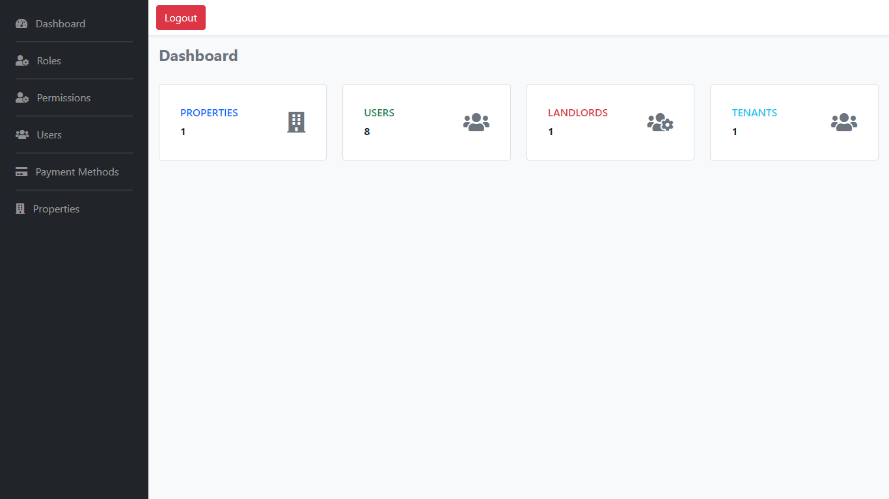

# Rental Management System

Application for landlords to manage their properties, rooms and tenants

## Welcome Page

The first page that the user land on when he / she visits the site. Also use gets redirected to this page after logging in so that they can navigate to the dashboard

<h3>Before Login</h3>

<h3>After Login</h3>

## Login Page

The only login page for both clients, landlords and tentants

## Dashboard Page

The general overview of the current status of the system

## Roles and Permissions

Define and restrict access to the different groups of users, i.e the admin, landlord and tenant. This protects sensitive data and information from being access by the wrong people

### Permissions Page

### Roles Page

## Users

At times you may want to view just all the users, to maybe change role and other stuffs, this pages shows all users of the system regardless of whether they are landlords, admins or tenants

### Users Page

## Payment Mehods

This helps determine exactly where the money is, MPESA, Cash and Others basically the means that you obtained the money

### Payment Methods Page

## Properties

This is a non-trivial section of the system, shows all the properties in the system with links and buttons for making changes and navigating to different property components

### All Properties

### Property Details

### Property Rooms

### Property Tenants

## Tenant Pages

Shows a single tenant details, payments and interactions with system

### Tenant Details

### Tenant Payments

### Messages Payments

Visit the site
<a href="https://real-estate-mgt-sys.herokuapp.com/">Rental Management System</a>

<pre>
Login Credentials for admin
Email : admin@example.com
Password : password
</pre>

